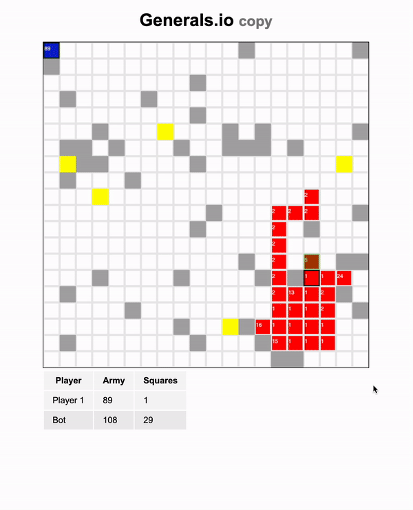

# 38k-generals

This is generals.io copy.

The 38k means 38k feet above ground. I've challenged myself to write a game in the plane on the way from Prague to Tenerife. The surroundings were disturbing and the person sitting in front of me kept lowering their seat into horizontal state.

Even with that I've programmed this on the about 5h flight.

(It's a game inspired by of generals.io which for now [forever] works only locally and your opponent is random bot.)

As one can expect, the hardest thing about this is that you are constrained by zero dependencies and lack of internet. You can use only what you have which may be limiting but GREATLY simplifies things.
